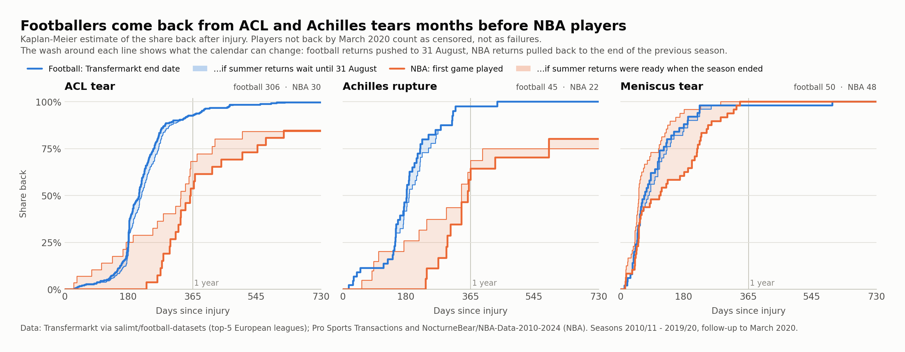
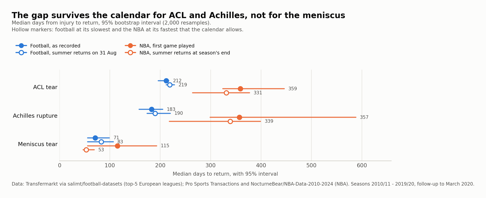
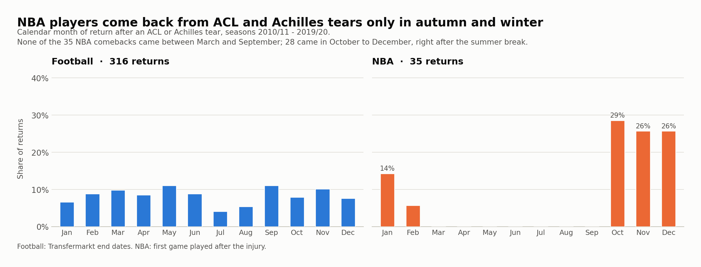
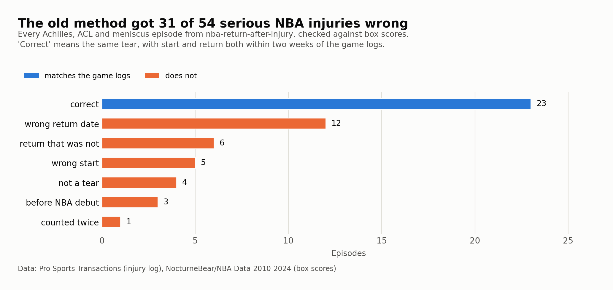
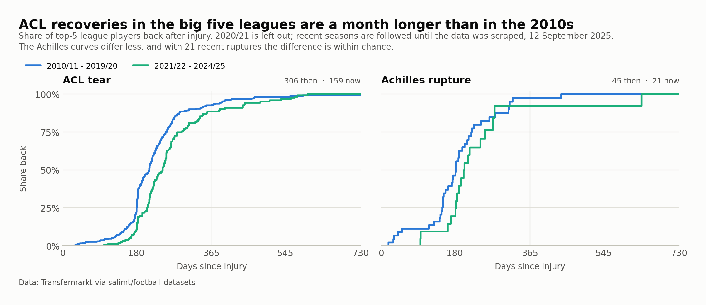

# Снова на поле, снова на площадке

Сколько элитные спортсмены пропускают после разрыва передней крестообразной связки, ахиллова сухожилия или мениска: пять ведущих футбольных лиг Европы против NBA, сезоны 2010/11 – 2019/20. Открытые данные, воспроизводимый расчёт на Python.

После разрыва ПКС половина футболистов возвращается через 212 дней, половина игроков NBA — через 359. Для разрыва ахилла медианы составляют 183 и 357 дней. Разрыв сокращается, но сохраняется, даже если довести летний перерыв до крайних допущений в обоих видах спорта. По мениску данные не позволяют различить футбол и баскетбол.

[English version](README.md)



| Травма (футбол / NBA, случаев) | Футбол, по данным | NBA, по данным | Футбол, граница | NBA, граница |
|---|---:|---:|---:|---:|
| Разрыв ПКС (306 / 30) | 212 (196–217) | 359 (324–446) | 219 (212–228) | 331 (264–377) |
| Разрыв ахилла (45 / 22) | 183 (158–205) | 357 (299–588) | 190 (174–220) | 339 (218–399) |
| Разрыв мениска (50 / 48) | 71 (56–99) | 115 (56–193) | 83 (56–107) | 53 (47–69) |

Медиана дней от травмы до возвращения, в скобках 95% бутстрэп-интервал. Через год после разрыва ПКС в строю 92,6% футболистов и 53,7% игроков NBA (68,1% на границе). Для ахилла — 97,5% и 64,3% (68,6%).

## Как устроено сравнение

- Футбол: история травм Transfermarkt у игроков, попадавших в заявку на матч Премьер-лиги, Ла Лиги, Бундеслиги, Серии А или Лиги 1 в сезоне травмы. Конец травмы — дата окончания по Transfermarkt.
- NBA: журнал Pro Sports Transactions говорит, что порвано и когда; бокс-скоры матчей — когда игрок впервые снова вышел на площадку.
- Случай засчитывается, только если часть тела и разрыв названы в одной записи.
- Наблюдение обрывается в марте 2020 года, когда оба вида спорта остановились. Не вернувшиеся к этому моменту цензурируются, поэтому кривые — оценки Каплана–Мейера.
- Календарная граница — крайний вариант для каждого вида спорта. Игрок NBA, вернувшийся к старту сезона, мог быть готов намного раньше, поэтому его возвращение переносится на последний матч команды в прошлом сезоне. Футболиста, которого допустили в июне, июле или августе, переносим на 31 августа. Оба сдвига могут только сократить разрыв.



## Календарь NBA

Ни одно из 35 возвращений в NBA после разрыва ПКС или ахилла не пришлось на март–сентябрь, 28 пришлись на октябрь–декабрь. В футболе возвращения распределены по всему году. Без границы часть срока в NBA была бы летним перерывом, а не травмой.



## Исправление к прошлому проекту

[nba-return-after-injury](https://github.com/PonomaryovPavel/nba-return-after-injury) собирал отсутствия только по журналу транзакций. Проверка по бокс-скорам подтвердила 23 из 54 эпизодов разрыва ахилла, ПКС и мениска. Остальные распределились так:

| Что пошло не так | Эпизодов |
|---|---:|
| возвращение записано не в тот день (ошибка от 26 до 190 дней) | 12 |
| отчисление или другое движение по составу записано как возвращение | 6 |
| отсутствие открыто более ранней записью о другой травме | 5 |
| это вообще не разрыв | 4 |
| разрыв случился до дебюта в NBA | 3 |
| один и тот же разрыв посчитан дважды | 1 |

Вердикт по каждому эпизоду — в [results/nba_old_episodes_audit.csv](results/nba_old_episodes_audit.csv). Цифрами того проекта по этим трём травмам пользоваться нельзя, и [nba-injury-cost](https://github.com/PonomaryovPavel/nba-injury-cost) построен тем же методом.



## Проверки

- Отношения рисков с поправкой на возраст на границах: 2,54 (1,63–3,97) для ПКС и 3,11 (1,56–6,20) для ахилла; больше единицы — футболисты возвращаются раньше. Возраст влияния не показывает. Отношения рисков здесь работают только как тест: допущение о пропорциональности рисков между видами спорта не выполняется.
- Transfermarkt округляет даты окончания: 30 июня встречается в 8 раз, 31 декабря — в 6 раз чаще среднего дня. Без округлённых дат футбольные медианы по ПКС и ахиллу сдвигаются на день, при широкой разметке — на два и три дня, без вратарей не меняются.
- В Премьер-лиге после разрыва ПКС отсутствуют дольше, чем в остальных четырёх лигах: 243 дня против 197 (p = 0,00004). Медицина это или привычки редакторов — данные не говорят.
- В сезонах 2021/22 – 2024/25 футбольная медиана по ПКС — 245 дней, на месяц дольше, чем в 2010-х (p = 0,00013). Изменение по ахиллу, с 183 до 204 дней на 21 случае, укладывается в случайность.
- Опубликованные данные сходятся. Метаанализ 2025 года даёт 367 дней для игроков NBA после реконструкции ПКС ([D'Ambrosi et al.](https://www.sciencedirect.com/science/article/pii/S2059775425006418)); исследование травм элитных клубов UEFA — 6,6 месяца до тренировок и 7,4 месяца до матчей после разрыва ПКС в футболе ([Waldén et al., 2016](https://pubmed.ncbi.nlm.nih.gov/27034129/)).



## Чего эта работа не говорит

- Почему существует разрыв. Кандидаты — нагрузка при приземлениях на твёрдом паркете, защита контрактов, календарь лиг; ни один из них здесь не проверяется.
- Конечные точки разные: Transfermarkt фиксирует готовность играть, сторона NBA — первый сыгранный матч. По данным UEFA этот шаг занимает меньше месяца.
- Возвращение — не восстановление. Здесь не измеряется, вернулся ли игрок к прежнему уровню.
- Выборка NBA мала: направление выдерживает все проверки, точные сроки — нет.
- Transfermarkt не уточняет, какая крестообразная связка порвана. Повреждения задней связки в элитном футболе редки ([28 за 17 сезонов, медиана пропуска 31 день](https://doaj.org/article/72b96066724a499a8e8f3049a89af6b0)), поэтому они могут лишь слегка приукрасить футбол.
- Разорванный мениск либо частично удаляют, либо сшивают, и по срокам это отличается на месяцы; источники редко уточняют, что сделано. Календарная граница к тому же меняет порядок видов спорта, так что вердикта по мениску нет.

## Файлы

| Файл | Что это |
|---|---|
| `analysis.ipynb` | весь анализ с выводом ячеек — начинать отсюда |
| `get_data.py` | скачивает исходные таблицы по закреплённым коммитам и сверяет SHA-256 |
| `prepare_nba.py` | когорта NBA из журнала травм и бокс-скоров, проверка старого метода |
| `prepare_football.py` | футбольная когорта из истории травм Transfermarkt |
| `survival.py` | Каплан–Мейер, бутстрэп, log-rank, Кокс |
| `figures.py` | графики |
| `results/` | итоговые таблицы, которые пишет ноутбук |
| `data/nba_injuries_2010-2020.csv` | журнал травм NBA |

## Воспроизведение

```bash
git clone https://github.com/PonomaryovPavel/return-to-play-football-vs-nba.git
cd return-to-play-football-vs-nba
pip install -r requirements.txt
python get_data.py
jupyter lab analysis.ipynb
```

## Данные

- Футбол: история травм, профили и выступления игроков с Transfermarkt в сборке [salimt/football-datasets](https://github.com/salimt/football-datasets), на Kaggle — под CC0. Исходные данные принадлежат Transfermarkt, поэтому скачиваются при запуске и в репозитории не хранятся. Страницы собраны 12–13 сентября 2025 года.
- Травмы NBA: [Pro Sports Transactions](https://www.prosportstransactions.com/) через [gboogy/nba-injury-data-scraper](https://github.com/gboogy/nba-injury-data-scraper), на Kaggle — [NBA Injuries from 2010-2020](https://www.kaggle.com/datasets/ghopkins/nba-injuries-2010-2018) (CC0).
- Бокс-скоры NBA: [NocturneBear/NBA-Data-2010-2024](https://github.com/NocturneBear/NBA-Data-2010-2024) (MIT).
- Возраст игроков NBA: посезонная статистика из [Brescou/NBA-dataset-stats-player-team](https://github.com/Brescou/NBA-dataset-stats-player-team), как в прошлом проекте.

Код распространяется по лицензии MIT.

Предыдущие работы серии: [nba-injury-cost](https://github.com/PonomaryovPavel/nba-injury-cost), [nba-return-after-injury](https://github.com/PonomaryovPavel/nba-return-after-injury).
